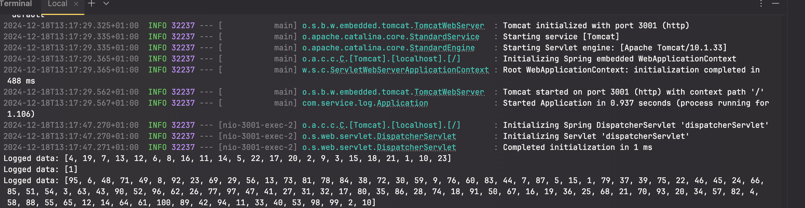

# Service Shuffle

## Overview

`service-shuffle` is a Spring Boot microservice that provides an API to shuffle an array of numbers from 1 to a given number using a performant algorithm.

## Features

- Accepts a number (1-1000) and returns a shuffled list of integers from 1 to that number.
- Asynchronously logs requests using a separate `service-log` microservice.

## Prerequisites

- Java 17
- Maven
- Spring Boot

## Setup and Installation

1. **Clone the Repository**

   ```bash
   git clone https://github.com/YOUR_USERNAME/service-shuffle.git
   cd service-shuffle

2. **Build the Project**

   ```bash
   mvn clean install
   
3. **Run the Application**

   ```bash
   mvn spring-boot:run
   
4. **Make a POST request (make sure service-log service is running as well)**
   ```bash
   curl --location 'http://localhost:3000/shuffle' \
   --header 'Content-Type: application/json' \
   --data '23'
   
5. **Observe the output in service-log console**

